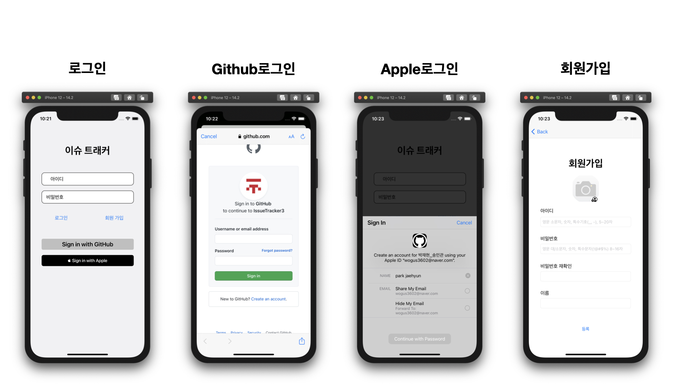
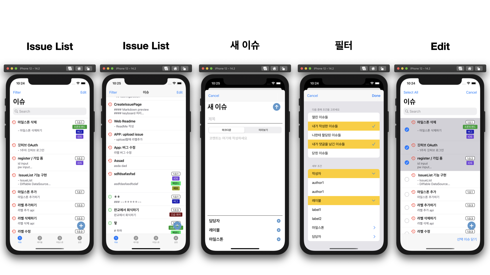
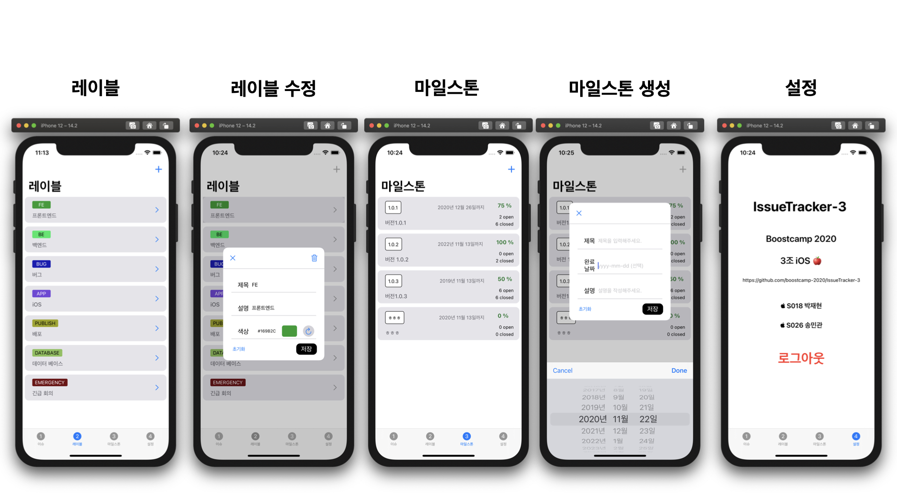
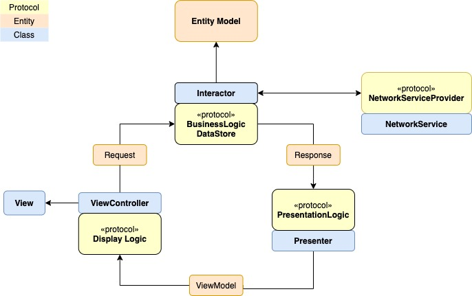

# IssueTracker iOS app 
[](https://github.com/boostcamp-2020/IssueTracker-3/releases)
[](https://github.com/boostcamp-2020/IssueTracker-3/actions)

## 화면 구성





## Architecture
- VIP
- [Clean Swift](https://clean-swift.com/) 적용




## View
|  | View | DataSource | Layout | Cell |
|:-:|:-:|:-:|:-:|:-:|
| IssueList | CollectionView | DiffableDataSource | CompositionalLayout | CollectionViewListCell |
| IssueDetail | CollectionView | DiffableDataSource | FlowLayout | CollectionViewCell |
| Label | CollectionView | DiffableDataSource | FlowLayout | CollectionViewCell |
| Milestone | CollectionView | DiffableDataSource | FlowLayout | CollectionViewCell |
| Filter | TableView | DiffableDataSource | X | TableViewCell |

## Network
- `NetworkService`객체 & `NetworkServiceProvider`Protocol
- URLSession 사용
- [Code 보러가기](https://github.com/boostcamp-2020/IssueTracker-3/tree/master/iOS/IssueTracker/IssueTracker/Network)

## Authentication
- github OAuth
- Sign in with Apple
- 회원가입
- 로그인
- 서버에서 받은 JWT를 KeyChain을 사용하여 안전하게 저장
   - Property Wrapper 사용
   - 참고자료 : [KeyChain](https://medium.com/@justfaceit/ios-%EC%95%B1-%EB%B6%80%ED%92%88-%EB%A7%8C%EB%93%A4%EA%B8%B0-1-preferencestorage-%EC%84%A4%EC%A0%95-%EC%A0%80%EC%9E%A5%EC%9D%84-%EC%9C%84%ED%95%9C-%EA%B3%B5%ED%86%B5-%ED%81%B4%EB%9E%98%EC%8A%A4-2eb2c27af941)
   
## Library
- [MarkdownView](https://github.com/keitaoouchi/MarkdownView)
- [SwiftyMarkdown](https://github.com/SimonFairbairn/SwiftyMarkdown)

## Requirements
 - iOS 14.0+
 - Xcode 12.1+
 - Swift 5.3+
 
## Cocoapods
```ruby
target 'IssueTracker' do

  pod 'SwiftLint'

end
```

## Installation
```
$ pod install
```


## Author
- 박재현 [@wogus3602](https://github.com/wogus3602)
- 송민관 [@Minkwan-Song](https://github.com/Minkwan-Song)


## License
This code is distributed under the terms and conditions of the [MIT license](LICENSE). 
