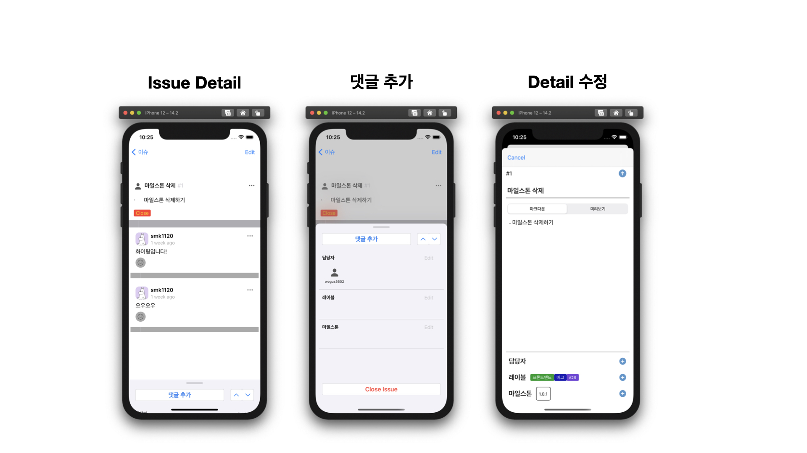

# IssueTracker iOS app 
[](https://github.com/boostcamp-2020/IssueTracker-3/releases)
[](https://github.com/boostcamp-2020/IssueTracker-3/actions)


## 화면 구성





## Network
URLSession으로 Service를 만들어서 사용

## Requirements

 - iOS 14.0+
 - Xcode 12.1+
 - Swift 5.3+
 
## Cocoapods

```ruby
target 'IssueTracker' do

  pod 'SwiftLint'

end
```
## Installation

```
$ pod install
```


## Author

- 박재현 [@wogus3602](https://github.com/wogus3602)
- 송민관 [@Minkwan-Song](https://github.com/Minkwan-Song)


## License

This code is distributed under the terms and conditions of the [MIT license](LICENSE). 
